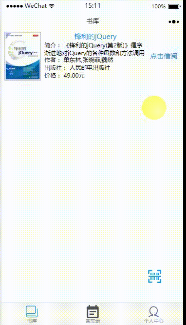

# wxapp
## 演示

## 记录遇到的问题
### 一:
> 问题：app.json中设置了tabBar为页面指定的页面A，在其他页面使用navigateTo无法实现跳转A页面

> 解决办法：navigateTo只能跳转到非导航页面，对于导航页面跳转可以用wx.switchTab
### 二：
> 问题：使用switchTab后tab不刷新

> 解决办法：
```
wx.switchTab({  
      url: '../index/index',  
      success: function (e) {  
        var page = getCurrentPages().pop();  
        if (page == undefined || page == null) return;  
        page.onShow();  
      }  
    })
```
### 三：
> 问题：页面之间传对象参数

> 解决办法：A-->B A页面传递参数先JSON.stringify(data)，B页面接收参数先JSON.parse(data)


